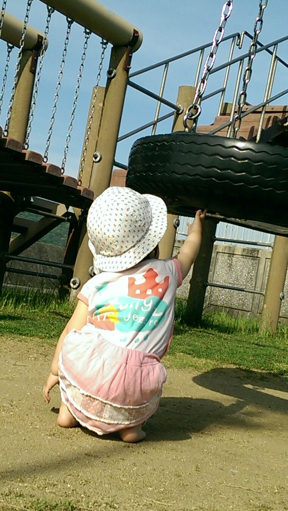

# agglomerative_partitioning

partitioning Image by Features in Agglomeratively

## KclassImage(k, feature, target, shape)

- `k` is a number of classes
- `feature` is a feature data
- `target` is a class data
- `shape` is a Image shape

it saves `f'{k}.jpg'`

## dist_table(feature, nrows, ncols)

- `feature` is a feature data
- `nrows` and `ncols` are Image shape

it return Feature distance table but only between neighboring samples in Image cordinates.

## agglomerative_clustering(feature, dist, K)

- `feature` is a feature data
- `dist` is a feature distance table made by `dist_table()`
- `K` is a number of target classes

it return target class data by samples

# example

Following code make 102144 partitions in sample.jpg(1344x760), reduce its colors by centroid's color and save to 102144.jpg

It means original 1344x760=1,021,440 clusters to 102,144 clusters
  
```{python}
from agglomerative_partitioning as ap
import numpy as np
from PIL import Image

ImageFileName = 'sample.jpg'
K = 102144

im = np.array(Image.open(ImageFileName))
nrows = im.shape[0]
ncols = im.shape[1]

feature = im.reshape((nrows * ncols, -1))

dist = ap.dist_table(feature, nrows, ncols)

target = ap.agglomerative_clustering(feature, dist, K)

ap.KclassImage(K, feature, target, (nrows, ncols))
```

|original, 1021440partitions | 102144partitions |
| --- | --- |
|||
